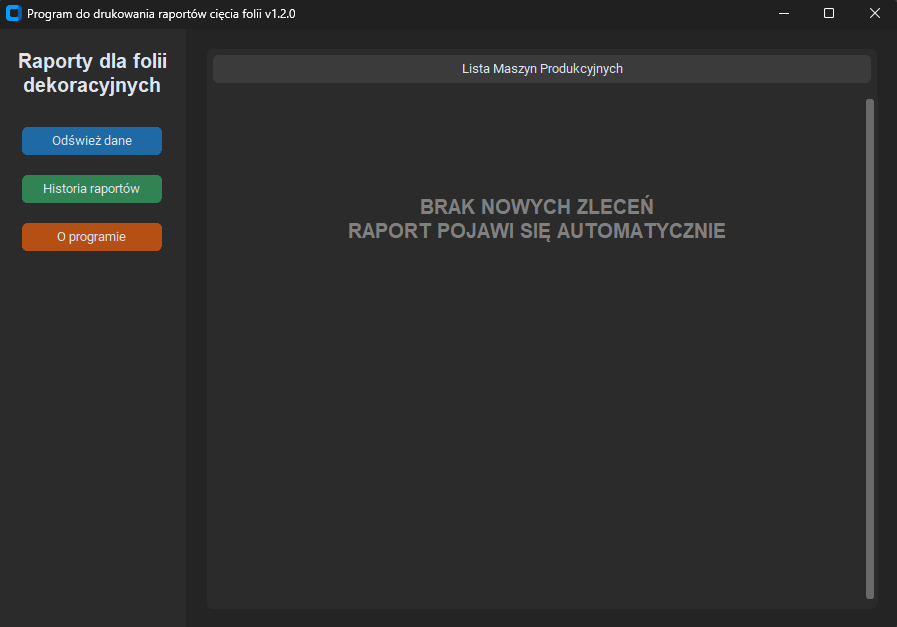
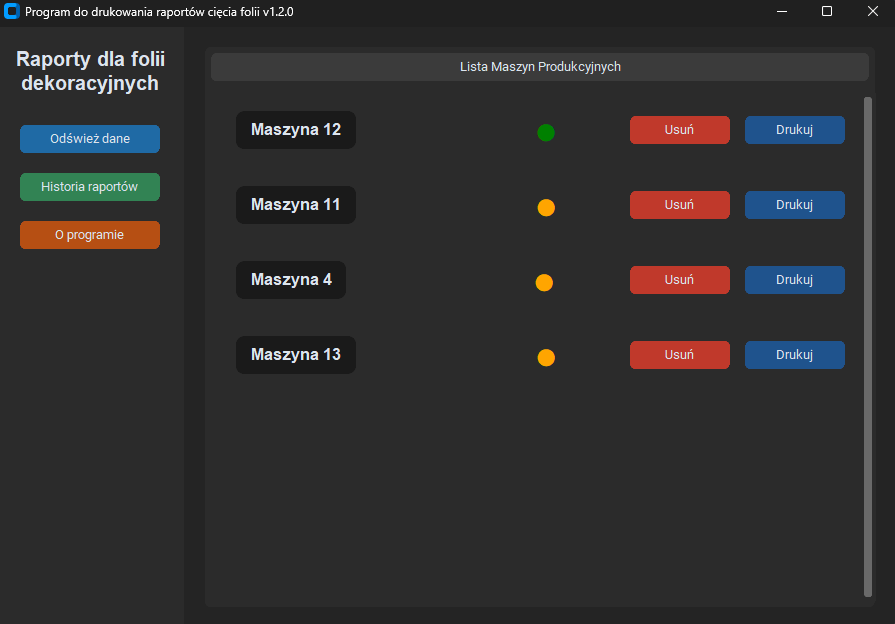

# Foil Cut Reporter

A manufacturing support application designed for real-time monitoring and reporting of lamination foil cutting processes, alongside profile geometry and Bill of Materials (BOM) management. The program operates continuously, providing production planners with dynamic updates.

## 📷 Screenshots

### Main Application Dashboard



### Loaded report


## 🚀 Key Features

- **Automated Data Refresh:** Continuous monitoring of production line parameters in real-time with a 30-second interval (featuring an optimized rendering mechanism to completely eliminate UI flickering).
- **Geometry & BOM Management:** Streamlined processing of profile indices, assembly configurations, and custom foil cutting parameters.
- **Auto-Update Notification System:** Built-in version checking mechanism that automatically triggers a pop-up window notifying the user whenever a newer release is deployed on the network server.

## 🛠️ Tech Stack

- **Language:** Python 3.10+
- **GUI Framework:** CustomTkinter
- **Data Processing:** pandas, openpyxl
- **Distribution:** PyInstaller (standalone `.exe` for Windows 11)

## 📁 Project Structure

```text
foil_cut_reporter/
│
├── assets/                  # Application graphical assets and resources
├── config/
│   ├── paper_foils.json     # Configuration file for foils data
│   ├── paths.py             # Global path management definitions
│   └── version.py           # Application version definition
│
├── database/
│   └── db_manager.py        # Database connection and query manager
│
├── deploy/
│   ├── deploy_gui.py        # Deployment scripts for UI modules
│   ├── deploy_logic.py      # Deployment core logic configuration
│   └── paths.py             # Deployment specific paths
│
├── gui/
│   ├── components/
│   │   ├── machine_card.py  # Reusable UI component representing a single machine
│   │   └── popup_about.py   # Information popup modal
│   └── app_view.py          # Main application window framework
│
├── logic/
│   └── report_engine.py     # Core foil cutting optimization and reporting logic
│
├── updater/
│   ├── icon.ico             # Executable icon asset
│   ├── icon.png             # Application logo image
│   ├── PyInstaller_HowTo.txt # Internal guidelines for compiling the app
│   └── updater.py           # Remote version checking and update logic
│
├── .gitignore               # Git untracked files configuration
├── app.py                   # Application main entry point
├── README.md                # This documentation file
├── requirements.txt         # Project third-party dependencies
└── run_deploy.py            # Script triggering deployment and distribution builds
